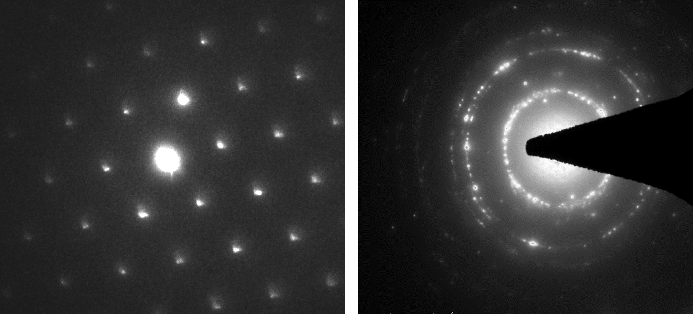
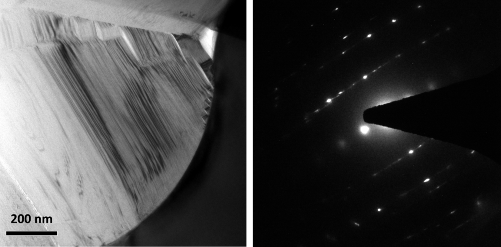
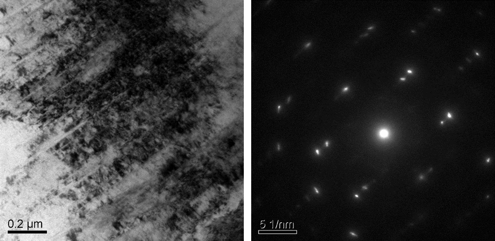
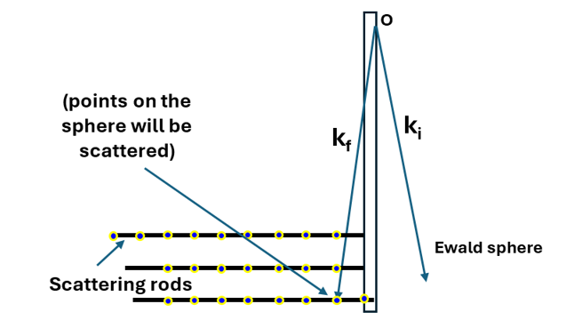

<!-- Selected Area Diffraction Pattern or SADP are widely used for the determination of crystal structures, orientations, examine crystal defects or material textures. Majorly, two kind of diffraction pattern can be observed. A regular pattern of bright spots (spot pattern) can be seen in the diffractogram if it is obtained from one or a few single crystals (Figure on the left). On the other hand, when numerous differently orientated crystallites are covered by the aperture area, their diffraction patterns superimpose to form an image of concentric rings which are often referred to as ring pattern (Figure on the right). As this spots or the rings represents the two-dimensional projection of reciprocal crystal lattice, the distance between the centre point and the spots can be utilized to measure the interplanar distance and the orientation relationship between the corresponding planes.   -->
The selected area diffraction pattern (SADP) is a critical technique for analyzing the crystallographic structure of a material by obtaining a diffraction pattern from a specific region of the sample. The formation of a well-defined SADP relies on precise zone axis alignment, which ensures that multiple lattice planes satisfy the Bragg condition simultaneously. The zone axis is a specific crystallographic direction in the sample that is aligned parallel to the incident electron beam, allowing the electron wave to interact coherently with the periodic atomic structure. Achieving this alignment is essential for generating an interpretable diffraction pattern, and it is done by carefully tilting the sample using the TEM goniometer stage until a high-symmetry orientation, such as [100], [110], or [111], is reached. When aligned correctly, the reciprocal lattice points corresponding to that zone axis appear as an ordered array of diffraction spots in the SADP, revealing valuable information about the crystal structure, symmetry, and possible defects in the material.  

To obtain an SADP, a selected area aperture (SAA) is inserted into the image plane of the TEM, just below the objective lens. This aperture physically restricts the region of the sample contributing to the diffraction pattern, allowing for localized diffraction analysis. The process begins with focusing the image of the sample at a high magnification, followed by selecting a region of interest using the SAA. After inserting the aperture, the TEM is switched to diffraction mode, where the objective lens is adjusted to bring the diffraction pattern into focus. The size of the selected area in real space directly affects the precision of the diffraction pattern, with smaller apertures providing greater spatial resolution but lower diffraction intensity. Once the pattern is acquired, analysis of the relative positions, intensities, and symmetry of the diffraction spots provides information about lattice parameters, phase identification, and structural defects such as stacking faults, twinning, and strain-induced distortions. Additionally, systematic absences in the diffraction spots help determine the space group of the crystal. The accuracy of SADP depends on precise zone axis alignment, careful aperture placement, and optimal microscope settings to minimize artifacts.  

 

<b>Figure 1.</b> Different types of SADP (a) Spot pattern (b) Ring pattern.  

As diffraction reflects the crystal symmetry, any defects present in the crystal or sample such as dislocations, twins or stacking fault can affect the shape or size of the diffraction patterns in the form artefacts. As for example, if stacking fault (which is basically a missing stacking sequence of atoms in lattice) is present in the sample, the diffraction points from the area may come as “streaks” because of very small thickness of the sample (typically few nanometres). Whereas in case of twin also extra reflections can be observed. In case of the SADP from the twin planes, an orientation relationship can be observed. A typical bright field TEM micrograph of stacking fault and twins and corresponding SADP patterns are represented below.  
 

<b>Figure 2.</b> SADP pattern from stacking faults in Hexagonal NbTiCrZrB2 sample.  

 

<b>Figure 3.</b> SADP pattern from twins in FCC-CoCrFeMnNiSi0.02 sample. 

<b>Stacking Faults: </b> 
Stacking Faults create a localized shift in atomic positions, they introduce an additional phase shift in the scattered electron waves, causing diffuse intensity and streaking in the diffraction pattern along the reciprocal lattice vector perpendicular to the fault plane. The length of the streaks depends on the fault density—higher stacking fault densities result in more pronounced streaking. Whereas, in reciprocal space, twinning leads to split or elongated diffraction spots due to the superposition of two closely related but slightly misaligned lattice orientations. This effect generates streaks in specific crystallographic directions corresponding to the twin plane.  
 
<b>Figure 3.</b>  Schematic representation of scattering   

<b>Indexing of SADP: </b>Indexing a Selected Area Diffraction Pattern (SADP) is the process of identifying the crystallographic planes and zone axis that correspond to the observed diffraction spots. The key steps involved in indexing an SADP are: 

•	<b>Identify the Zone Axis: </b>The zone axis is the direction of the incident electron beam relative to the crystal lattice. In a well-aligned SADP, the zone axis corresponds to the center of the diffraction pattern, and all diffraction spots represent planes perpendicular to it. 

•	<b>Measure Interplanar Spacings:</b> The distance between diffraction spots is related to the reciprocal lattice spacing of the crystal planes. Using the camera length (L) and electron wavelength (λ), the interplanar spacing d for a given diffraction spot can be calculated as: 𝑑 = 𝜆𝐿/𝑅  
where, R is the measured distance of the diffraction spot from the central transmitted beam (in calibrated units). 

•	<b>Determine the Miller Indices (hkl): </b>The diffraction spots correspond to reflections from specific crystallographic planes with Miller indices (hkl). By comparing the calculated d-spacing values with known values from standard crystal structure data (eg., FCC, BCC, HCP), the indices of the reflections can be assigned. 

•	<b>Check the Reciprocal Lattice Geometry: </b>The geometry of the diffraction pattern should match the expected symmetry of the crystal system (e.g., cubic, hexagonal, tetragonal). The relationship between diffraction spots can be verified using zone axis rules and the g·r = n, extinction rule for allowed reflections. 

•	<b>Compare with Known Crystallographic Data: </b>Using reference data such as ICDD (International Centre for Diffraction Data) or JCPDS (Joint Committee on Powder Diffraction Standards), the indexed pattern can be cross-verified for accuracy.

